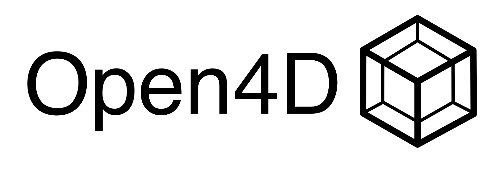

# Open4D
Open4D is a lightweight library for simulating four dimensional physics and geometry. Built with usability in mind, Open4D aims to provide a toolkit for various usages of 4D physics. Regardless of needs, Open4D provides a robust toolkit for hobbiests, developers, and researchers exploring four dimensional space.

# Usage
Open4D aims to provide 4D features in a lightweight and cross-platform library. Currently, this project provides working tools for generating primitive shapes and creating 3D cross-sections. Currently, users can create six different primitive shapes, including:

- The 5-Cell, or Pentachoron. This is the simplest 4D shape.
- The 8-Cell, also known as the Tesseract. This is the 4D equivalent of a cube and most recognizable shape. It's also the inspiration for the Open4D logo.
- The 16-Cell, or hexadecachoron, is the simplest structure with no 2D/3D equivalent.
- The 24-Cell, or hyperdiamond.
- The 120-Cell, or hyperdodecahedron. This is the 4D-equivalent of the dodecahedron, with 120 dodecahedral cells.
- The 600-Cell, or hexicosachoron. This is the dual-polytope of the 120-Cell, and contains 600 tetrahedral cells.

From these shapes, users can create cross sections that can be used in 3D space and rendered. As of right now, Open4D does not provide finished tools for physics simulation. This is currently in development, and should be released in the coming months.

# Contributing
We welcome any and all developers interested in contributing to this project. Open4D is *for* developers of any technical background, and we encourage developers of any background to contribute. If you're unsure how to contribute to the project, we heavily advise looking at the open Github Issues. These forums can provide insight into what needs immediate work, and how new users can contribute.

## Issues
Given the advanced nature of higher-dimensional space, and the community-oriented development of Open4D, errors and bugs are inevitable. If you observe a runtime error or bug, go to the *Issues* tab on Github. From there, create a new issue, adding an appropriate title and documentation of the bug. Everyone is welcome to contribute to Issues, and discussion should remain civil, aiming to fix the issue and contribute to the project.

## Non-Developers
Open4D is a physics engine with a strong focus on kinematics and geometry. If you do not know how to code, or how to code in C/C++ (Given you're implementing core functionality), there are still ways to contribute. If you have a background in physics, higher dimensional geometry, or other topics that may be valuable to development, there are still ways to contribute. On our Github Wiki, there's information on the math behind our project. If you'd like to update or correct this math, you can create a new Issue, and work with other developers to implement of fix previous mathmatical concepts. For non-developers interested in adding new methods or features to this library, the same process is used.

# Legal
Open4D is licensed under the "ZLib License" In short, any usage of this project is permitted, so long as the original license is included, a change to the software is noted, and the product is not claimed to be the creation of any individual other than William Gibbs, S.V, or the Open4D open-source community. This is not legal advice. For the official license for Open4D, go to [LICENSE.md](LICENSE.md)

